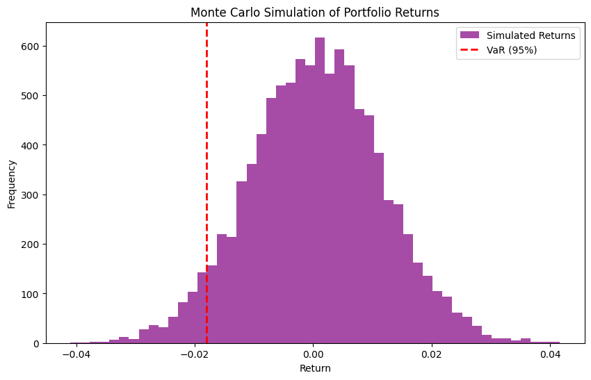
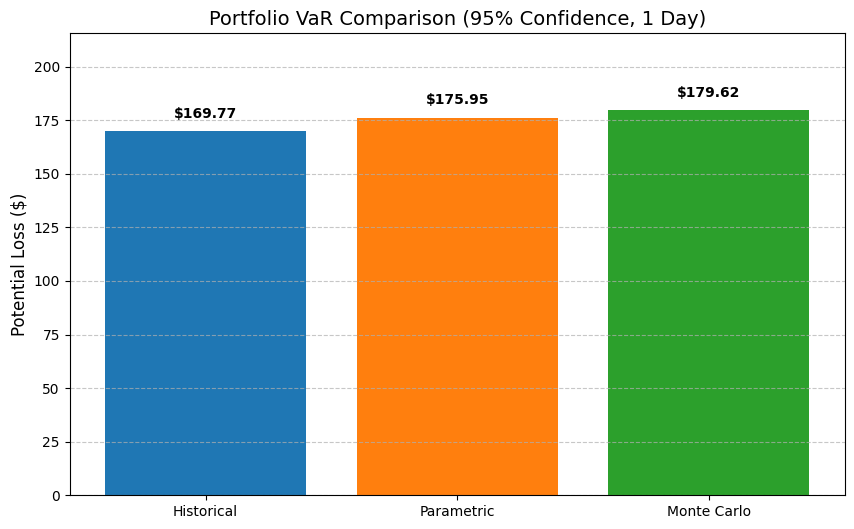

# Quantitative Risk Lab
**Current Status:** Active Sprint (Jan 2026)

## Objective
To build a production-grade Risk Management engine in Python that bridges the gap between academic theory and financial regulation (Basel III).

## Modules (The 60-Day Roadmap)
1. **Market Risk Engine:** Historical, Parametric, and Monte Carlo VaR. (In Progress)
2. **Volatility Forecasting:** GARCH(1,1) vs. EWMA. (Upcoming)
3. **Credit Risk:** Merton Model & Probability of Default. (Upcoming)
4. **Stress Testing:** Scenario Analysis for Macro-Economic Shocks. (Upcoming)

## Tech Stack
* **Language:** Python 3.10+
* **Libraries:** Pandas, NumPy, Scikit-Learn, SciPy
* **Data Source:** Yahoo Finance (yfinance), FRED (Federal Reserve)

---

## Day 3: Monte Carlo Simulation 🎲
**Goal:** Implement a stochastic model to predict future portfolio performance under non-normal market conditions.

**Key Features Implemented:**
- **Monte Carlo Engine:** Generated 10,000 random market scenarios to model tail risk.
- **Cholesky Decomposition:** Applied Linear Algebra to preserve the correlation structure between assets (e.g., maintaining the positive correlation between SPY and AAPL during crash simulations).
- **Visualization:** Plotted the distribution of potential future returns to identify tail events.

**Results:**
- **Monte Carlo VaR (95% Confidence):** $[$180.32] 

## Day 4: Model Validation Dashboard 📊
**Goal:** Compare and validate different risk models to ensure robustness.

**What I built:**
- Integrated all three engines (Historical, Parametric, Monte Carlo) into a single dashboard.
- Created a visualization to compare the 95% VaR estimates side-by-side.
- **Analysis:**
The Monte Carlo simulation produced the highest VaR estimate ($[$179.62]). This indicates that the stochastic model successfully captured "tail risk" and potential correlation breakdowns that the Parametric (Normal Distribution) and Historical models might have smoothed out. As a result, the Monte Carlo metric serves as our conservative baseline for capital allocation.

**Outcome:**
- Historical VaR: $[$169.77]
- Parametric VaR: $[$175.95]
- Monte Carlo VaR: $[$179.62]

