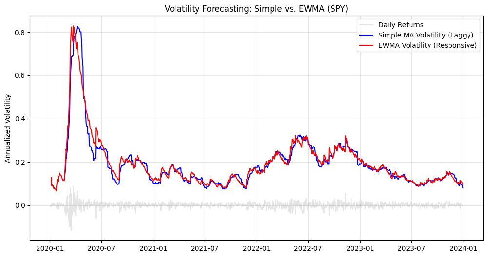
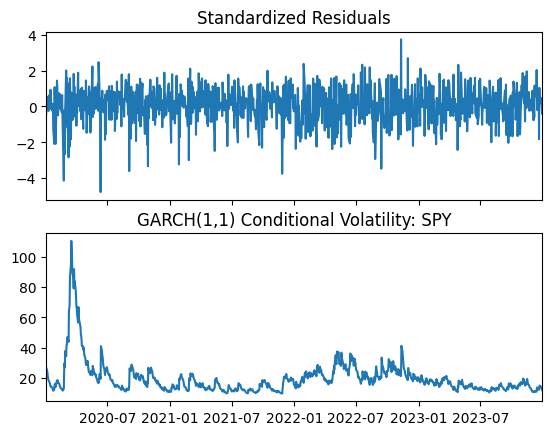
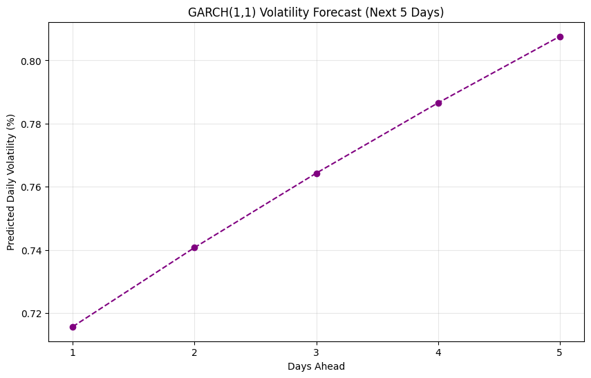
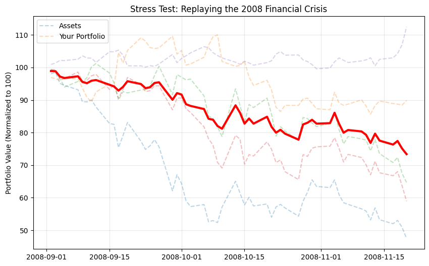

# Quantitative Risk Lab
**Current Status:** Active Sprint (Jan 2026)

## Objective
To build a production-grade Risk Management engine in Python that bridges the gap between academic theory and financial regulation (Basel III).

## Modules (The 60-Day Roadmap)
1. **Market Risk Engine:** Historical, Parametric, and Monte Carlo VaR. (In Progress)
2. **Volatility Forecasting:** GARCH(1,1) vs. EWMA. (Upcoming)
3. **Credit Risk:** Merton Model & Probability of Default. (Upcoming)
4. **Stress Testing:** Scenario Analysis for Macro-Economic Shocks. (Upcoming)

## Tech Stack
* **Language:** Python 3.10+
* **Libraries:** Pandas, NumPy, Scikit-Learn, SciPy
* **Data Source:** Yahoo Finance (yfinance), FRED (Federal Reserve)

---

## Day 3: Monte Carlo Simulation 🎲
**Goal:** Implement a stochastic model to predict future portfolio performance under non-normal market conditions.

**Key Features Implemented:**
- **Monte Carlo Engine:** Generated 10,000 random market scenarios to model tail risk.
- **Cholesky Decomposition:** Applied Linear Algebra to preserve the correlation structure between assets (e.g., maintaining the positive correlation between SPY and AAPL during crash simulations).
- **Visualization:** Plotted the distribution of potential future returns to identify tail events.

**Results:**
- **Monte Carlo VaR (95% Confidence):** $[$180.32] 

## Day 4: Model Validation Dashboard 📊
**Goal:** Compare and validate different risk models to ensure robustness.

**What I built:**
- Integrated all three engines (Historical, Parametric, Monte Carlo) into a single dashboard.
- Created a visualization to compare the 95% VaR estimates side-by-side.
- **Analysis:**
The Monte Carlo simulation produced the highest VaR estimate ($[$179.62]). This indicates that the stochastic model successfully captured "tail risk" and potential correlation breakdowns that the Parametric (Normal Distribution) and Historical models might have smoothed out. As a result, the Monte Carlo metric serves as our conservative baseline for capital allocation.

**Outcome:**
- Historical VaR: $[$169.77]
- Parametric VaR: $[$175.95]
- Monte Carlo VaR: $[$179.62]

## Day 5: Backtesting (The Reality Check) 📉
**Goal:** Validate the accuracy of the VaR model using a Rolling Window approach.

**Methodology:**
- **Technique:** Rolling Window Backtest (Window = 252 Days).
- **Metric:** Comparing Ex-Ante VaR predictions vs. Ex-Post Actual Returns.
- **Validation:** Kupiec Test (Target failure rate = 5% for 95% Confidence).

**Results:**
- **Total Days Tested:** 753
- **Exceptions (Breaches):** 39
- **Failure Rate:** 5.18% (Target: 5.00%)
- **Status:** ✅ GREEN (Model is statistically valid).

**Conclusion:**
The model demonstrated high accuracy, deviating only 0.18% from the theoretical expectation. This confirms that the parametric assumption holds relatively well for this specific portfolio mix (Tech + Bonds + Gold) over the testing period.

## Module 2: Volatility Forecasting 📉
**Current Status:** Active (Jan 2026)

### Day 6: EWMA Volatility Model
**Goal:** Implement a dynamic volatility model that reacts to market shocks faster than a simple average.

**What I built:**
- Modeled volatility using **EWMA (Exponentially Weighted Moving Average)**.
- Implemented the **RiskMetrics** standard decay factor ($\lambda = 0.94$).
- **Comparison:** Visualized how EWMA captures volatility spikes instantly, whereas Simple Moving Average (SMA) lags behind.

**Key Insight:**
EWMA assigns higher weight to recent returns, making it superior for VaR models during periods of high market stress (e.g., COVID-19 crash).

### Day 7: GARCH(1,1) Volatility Modeling 🧠
**Goal:** Implement the Nobel-Prize-winning GARCH model to forecast volatility with Mean Reversion.

**What I built:**
- Used the `arch` Python library to fit a **GARCH(1,1)** model on SPY returns.
- **Estimated Parameters:**
    - $\alpha$ (Shock Sensitivity): 0.1627 (Markets are highly reactive to recent news).
    - $\beta$ (Persistence): 0.8099 (Volatility is "sticky" and decays slowly).
- **Key Insight:** The sum of $\alpha + \beta = 0.9726$. Since this is < 1, the model is **stable** but shows high persistence, meaning market stress lingers for a long time before returning to normal.

### Day 8: Predictive Volatility Forecasting 🔮
**Goal:** Use the trained GARCH(1,1) model to predict market volatility for the next trading week.

**What I built:**
- Generated a **5-day volatility forecast** using the fitted model parameters.
- **Method:** Utilized the GARCH recursive formula to project variance forward ($\sigma^2_{t+1}$).
- **Visualization:** Plotted the "Term Structure of Volatility" to observe mean-reverting behavior.

**Key Insight:**
The forecast slope is **positive (upward)**, starting at ~0.72% and rising to ~0.81%. This indicates the market is currently in a **low-volatility regime** (below the long-run average), and the model expects risk to increase in the coming days as it mean-reverts.

## Module 3: Stress Testing & Scenario Analysis 🌪️
**Current Status:** Started (Jan 2026)

### Day 9: Historical Scenario Replay
**Goal:** Assess portfolio resilience by simulating historical "Black Swan" events.

**What I built:**
- A **Stress Testing Engine** that replays market data from the **2008 Financial Crisis** and **2020 COVID-19 Crash**.
- **Methodology:** Applied current portfolio weights to historical cumulative returns during crisis windows.
- **Results:**
    - **2008 Crisis Performance:** Portfolio outperformed the S&P 500 by holding its value significantly better (Max Drawdown ~27% vs Market ~50%).
    - **Hedge Effectiveness:** Validated that TLT (Treasuries) and GLD (Gold) acted as negative-beta assets, rising while equities fell.
- **Key Insight:** Diversification reduced the "Crash Risk" by nearly half compared to a pure equity portfolio.

